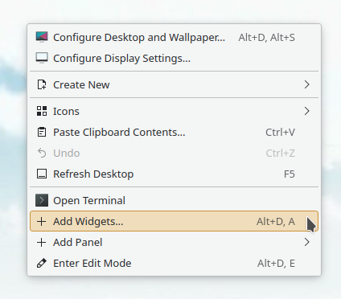
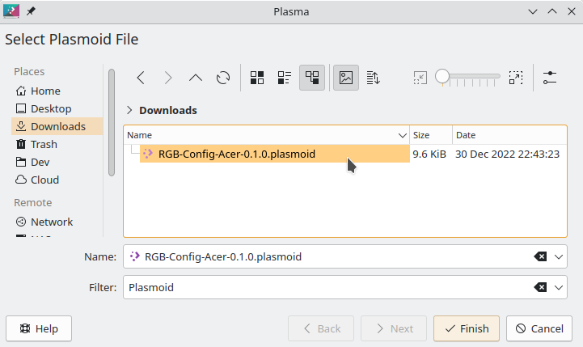

# RGB-Config-Acer-gkbbl-0-Plasma-Widget
A KDE plasma widget for controlling RGB settings of the Acer-WMI kernel module via the acer-gkbbl-0 character device (4 zone RGB keyboards)

Visit JafarAkhondali's [project page](https://github.com/JafarAkhondali/acer-predator-turbo-and-rgb-keyboard-linux-module) for information on the required kernel module

For a non-KDE solution and additional functionality check out my [other project](https://github.com/x211321/RGB-Config-Acer-gkbbl-0/)


# Features
 * Configure RGB settings of the Acer-WMI kernel module via the acer-gkbbl-0 character device
 * Supports all available RGB modes (Static, Breath, Neon, Wave, Shifting and Zoom)

# Restrictions
 * Compatible Acer-WMI kernel module **must be installed separately**
 * Compatibility depends on the specific laptop model and its compatibility with the kernel module
 
 # Installation
> ⚠ Make sure you have the **acer-gkbbl-0** RGB device available before you proceed with the installation of this application, otherwise it will have no effect. Visit JafarAkhondali's [project page](https://github.com/JafarAkhondali/acer-predator-turbo-and-rgb-keyboard-linux-module) for more information on the required kernel module.

> **RGB-Config-Acer-gkbbl-0-Plasma-Widget** uses Python to communicate with the **acer-gkbbl-0** RGB device. Python3 must be available for this Widget to work.

---

## Manual install (GUI)
I have not yet uploaded the widget to the KDE store, I plan on doing so once the widget has been tested for a while.

To manually install the widget download the **.plasmoid** file from the [releases page](https://github.com/x211321/RGB-Config-Acer-gkbbl-0-Plasma-Widget/releases) and open it through the KDE widget manager. 

### **Open the KDE widget manager**




### **Select "Install Widget From Local File"**


### **Navigate to the previously downloaded .plasmoid file and double click the file name**




### **The widget should now display in your system tray**


From here out you can either use the widget via the system tray or use the KDE widget manager to place the widget on your desktop, taskbar or wherever you like.

You can disable the widget via the KDE system tray configuration if you don't want it in your system tray.


## Manual install (Command line)
Use the following command to install the widget via command line
```
plasmapkg2 -u RGB-Config-Acer-<VERSION>.plasmoid
```

